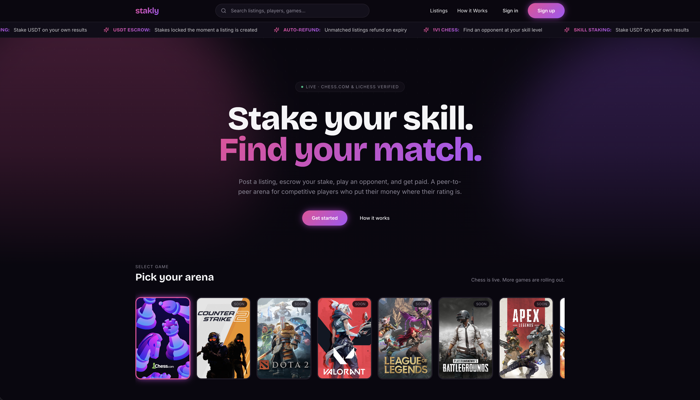

# Stakly

P2P skill-based staking marketplace. Players post listings to find an opponent and stake crypto on the match outcome — both stakes are escrowed, the match is played on the supported game's platform, the system auto-fetches the outcome from the platform's API, and the winner is paid out minus a platform fee.

**Today:** chess only (chess.com + Lichess), USDT denomination, custodial via internal Postgres ledger. **Not a dApp / web3 protocol** — there are no smart contracts and no on-chain game logic; crypto is a deposit/payout rail only.

<p align="center">
  
</p>

For full project context, see [CLAUDE.md](./CLAUDE.md). For roadmap and active work, see [milestones.md](./milestones.md) (active) and [milestones_archived.md](./milestones_archived.md) (shipped).

---

## Tech Stack

| Layer        | Stack                                                                                         |
| ------------ | --------------------------------------------------------------------------------------------- |
| Language     | PHP 8.5, TypeScript                                                                           |
| Backend      | Laravel 13, Filament 5 (admin), Fortify (auth)                                                |
| Frontend     | Inertia v3 + React 19, Tailwind CSS 4, shadcn/ui                                              |
| Realtime     | Laravel Reverb (WebSockets) + Echo (`@laravel/echo-react`)                                    |
| Routing glue | Laravel Wayfinder (typed JS route helpers)                                                    |
| Database     | Postgres 18                                                                                   |
| Cache / queue / session | Redis + Postgres (Laravel defaults for cache/queue/session tables)                |
| Media        | spatie/laravel-medialibrary (avatars, chat attachments)                                       |
| Permissions  | spatie/laravel-permission                                                                     |
| Testing      | Pest 4 (Feature + Unit), `RefreshDatabase` against Sail Postgres                              |
| Tooling      | Laravel Pint (formatter), ESLint 9, Prettier 3, Laravel Boost (MCP for code generation)       |
| Local dev    | Laravel Sail (Docker Compose) — `laravel.test`, `pgsql`, `redis`, `mailpit`, `reverb`, `queue`, `lichess-stream`, `ssr` |
| Package mgr  | `pnpm` (cross-platform `supportedArchitectures` configured)                                   |

Dependency versions live in `composer.json` and `package.json`; Boost's curated guidelines in [CLAUDE.md](./CLAUDE.md) list the canonical major versions for each ecosystem package.

---

## Architecture

Layered around the match lifecycle. Each request flows through thin HTTP controllers into orchestration Actions, which call narrow Services for primitives.

```
┌─────────────────────┐    ┌──────────────────────┐    ┌────────────────────┐
│  Inertia React UI   │───▶│  Laravel Controllers │───▶│  Action classes    │
│  (resources/js/)    │    │  (thin HTTP adapter) │    │  (orchestration)   │
└─────────────────────┘    └──────────────────────┘    └─────────┬──────────┘
        ▲                                                        │
        │ Reverb broadcast                                       ▼
        │                                            ┌──────────────────────┐
        │                                            │  Services            │
        │                                            │  • Wallet (money)    │
        │                                            │  • GameApi (outcome) │
        │                                            │  • SellerTrust       │
        │                                            └─────────┬────────────┘
        │                                                      │
        │                                                      ▼
        │                                            ┌──────────────────────┐
        └────────────── Reverb ◀───── Jobs ◀────────│  Postgres (ledger +  │
                                  (auto-fetch,      │   match state + chat)│
                                   link metadata)   └──────────────────────┘
```

### Key design decisions

- **All money writes go through `App\Services\Wallet`.** The invariant `users.usdt_balance == SUM(wallet_transactions.amount)` is asserted in tests. Idempotency via `reference_id` (e.g. `match-take:{id}`, `match-payout:{id}`). Amounts are BCMath strings at scale 6 — never floats.
- **Actions over services for orchestration.** One Action per verb (`TakeListingAction`, `SettleMatchAction`, `RequestCancellationAction`, …) with a single `handle()` method that reads like a recipe. `Wallet` and `GameApi` stay as primitives.
- **Snapshot, don't link.** Linked-account usernames are denormalized onto `match_provider_snapshots` at match creation, so a mid-match unlink can't break dispute arbitration.
- **API-truth outcomes.** Match results come from the game API (Lichess REST + stream, chess.com archive polling) — no player Won/Lost buttons. Settlement is triggered by an auto-fetched evidence card landing in chat. See [`App\Services\GameApi\ChessGameApi`](./app/Services/GameApi/ChessGameApi.php).
- **Layered auto-fetch surfaces:** match page visit, chat-send, 5-min cron, and a long-lived Lichess stream consumer all dispatch the same per-platform job (`AutoFetch*GameJob`), which is `ShouldBeUnique` per `match.id`.
- **SSR via Node sidecar.** Inertia + `php artisan inertia:start-ssr` for first-byte HTML; client `app.tsx` + server `ssr.tsx` mirror each other minus `configureEcho` (Echo is client-only).
- **Custodial, not on-chain.** No Solidity, no smart-contract escrow, no wallet-connect. Chain integration (M9) is paused pending a payment-gateway specialist.

Deeper context — visual system, component conventions, frontend-first build approach, performance rules — is in [CLAUDE.md](./CLAUDE.md).

---

## Getting Started

Prerequisites: Docker Desktop (or compatible engine), and PHP / Composer locally just to bootstrap Sail.

```bash
# Clone
git clone <repo-url>
cd stakly

# Bootstrap PHP deps (one-time, runs against host PHP — Sail isn't up yet)
composer install --ignore-platform-reqs --no-scripts

# Environment
cp .env.example .env
vendor/bin/sail up -d
vendor/bin/sail artisan key:generate

# Frontend deps (cross-platform bindings install per pnpm-workspace.yaml)
vendor/bin/sail pnpm install

# Database + seed data (creates platform user, test user with $10k balance, fake listings, etc.)
vendor/bin/sail artisan migrate:fresh --seed

# Frontend dev server
vendor/bin/sail npm run dev
```

The app is now at <http://localhost>. The admin panel is at <http://localhost/admin> (sign in with the seeded admin user — see [`database/seeders/AdminUserSeeder.php`](./database/seeders/AdminUserSeeder.php)).

### Useful URLs

| URL                                  | Purpose                                         |
| ------------------------------------ | ----------------------------------------------- |
| <http://localhost>                   | Marketing homepage                              |
| <http://localhost/listings>          | Public listings marketplace                     |
| <http://localhost/admin>             | Filament admin (disputes, games, CMS pages)     |
| <http://localhost:8025>              | Mailpit (catches outbound mail in dev)          |

### Optional sidecars

| Service                | When to start                                                                                     | Command                                            |
| ---------------------- | ------------------------------------------------------------------------------------------------- | -------------------------------------------------- |
| `reverb`               | Always (chat broadcasts depend on it)                                                              | Auto-starts with `sail up -d`                      |
| `queue`                | Always (broadcasts + auto-fetch jobs)                                                              | Auto-starts                                        |
| `lichess-stream`       | Always (settles Lichess matches the moment the game ends)                                          | Auto-starts                                        |
| `ssr`                  | Production-like SSR verification (profile-gated; needs `sail npm run build:ssr` bundle first)      | `vendor/bin/sail up -d ssr`                        |

---

## Project Structure

```
app/
├── Actions/              # Orchestration (verb-per-class). Domain subfolders: GameMatch, Listing, Message, LinkedAccount, Fortify, Admin
├── Broadcasting/         # Reverb channel auth (match.{id} private channel)
├── Concerns/             # Shared traits
├── Console/Commands/     # Scheduled commands: ExpireListings, MatchesResolveTimeouts, AutoFetchPendingMatches, LichessStreamCommand
├── Enums/                # Domain enums (MatchStatus, ListingStatus, WalletTransactionType, …)
├── Events/               # Broadcast events (MessageSent, …)
├── Exceptions/           # Domain exceptions (InsufficientBalanceException, …)
├── Filament/             # Admin panel: Resources (GameMatches, Games, Pages), Widgets (OpsOverview, PipelineHealth), Infolists
├── Http/
│   ├── Controllers/      # Thin HTTP adapters — validate, delegate to Action, flash + redirect
│   ├── Requests/         # FormRequest validation
│   └── Resources/        # Inertia / API resources (ListingResource, GameMatchResource, MessageResource)
├── Jobs/                 # Queueable work: AutoFetch{Lichess,ChessCom}GameJob, Fetch*MetadataJob
├── Models/               # Eloquent — thin (scopes, relations, small derived data)
├── Policies/             # Authorization gates
├── Providers/            # Service providers, container bindings
├── Services/             # Primitives: Wallet, GameApi/*, Provider/* (game-platform HTTP clients), SellerTrust
└── Support/              # Small helpers (SsrfGuard, MockTronAddress, …)

resources/js/             # Inertia React app
├── app.tsx               # Client entry (configureEcho lives here)
├── ssr.tsx               # SSR entry (mirrors app.tsx minus Echo)
├── pages/                # Page components — auth, listings, match, wallet, users, settings, cms
├── components/           # Organized by domain (NOT by type): site, home, auth, listings, match, wallet, profile, settings, ui (shadcn)
├── layouts/              # site-layout, player-hub-layout, auth-layout, settings/
├── hooks/                # use-match-chat, use-mobile, use-current-url, use-flash-toast, …
├── lib/                  # Small utilities (cn, formatters)
├── routes/               # Wayfinder-generated typed route helpers
├── actions/              # Wayfinder-generated controller action helpers
└── types/                # Shared TS interfaces

database/
├── migrations/
├── factories/
└── seeders/              # DatabaseSeeder, AdminUserSeeder, GameSeeder, PageSeeder, ListingSeeder, MatchHistorySeeder

tests/
├── Feature/              # Most tests live here — feature tests against the real Sail Postgres via RefreshDatabase
└── Unit/                 # Pure logic, no DB
```

Component-folder convention: **organized by domain, not by type.** Starter-kit components (`app-*`, `nav-*`, `breadcrumbs`, etc.) stay at the root of `components/`; new Stakly-specific code goes into a domain subfolder. See [CLAUDE.md](./CLAUDE.md) under "Component Folder Convention" for the full rule.

---

## Key Features

- **Listings marketplace.** Filterable + sortable board (game, stake range, skill range, time control, region, language). Stake is escrowed at listing creation — not at match — so listings represent committed capital.
- **Match lifecycle.** Take → escrow → Pending → auto-fetched API result → Settled (or Disputed → ManualReview → admin-resolved). Mutual cancellation (M10) is the cooperative early-exit.
- **Custodial Postgres ledger.** `wallet_transactions` is append-only; `App\Services\Wallet` is the single mouth for all balance changes. Idempotent via `reference_id`. Row-locked + transactional.
- **Linked accounts via bio-code challenge.** Players verify chess.com / Lichess ownership by pasting a generated code into their platform bio. Verified usernames are snapshotted per match so mid-match unlinks don't break arbitration.
- **Auto-fetched outcome verification.** Four redundant trigger surfaces (page-visit, chat-send, 5-min cron, Lichess game-end stream) dispatch a `ShouldBeUnique` per-match job that polls the relevant API and posts a verified game-card system message — which is also the settlement trigger.
- **Match chat with attachments + link previews.** Real-time via Reverb private channels. Image uploads re-encoded to strip EXIF. URL paste auto-fetches game-card metadata from Lichess / chess.com; other links get an OG card via SSRF-guarded fetch.
- **Filament admin panel** (`/admin`). Disputes queue with three resolve actions (Settle to Creator / Taker / Draw), CMS for About / Privacy / Terms (markdown), Games catalog (poster + status), ops + auto-fetch pipeline widgets.
- **Inertia SSR.** Global SSR via Node sidecar (`php artisan inertia:start-ssr`). Server-rendered first-byte HTML on every page.
- **Two-factor auth, password reset, email verification.** All via Fortify, with custom Stakly UI on top.
- **Active Mode.** Bybit-style global online toggle. Off = the user's open listings disappear from the public marketplace + profile without being cancelled.

---

## Development Workflow

### Frontend-first against real seeded data

Per [CLAUDE.md](./CLAUDE.md): UI is built against migrations + factories + seeders, not hardcoded route-closure props. For each entity with a UI:

1. Migration → model + factory → seeder with realistic edge-case data.
2. Controller returns the data via `Inertia::render(…)`.
3. React page component with a TypeScript interface for the props.

This lets us swap real business logic into the controller later without touching the frontend.

### Branches + commits

- Feature branches off `main`. Names like `feat/<topic>`, `fix/<topic>`, `style/<topic>`, `chore/<topic>`.
- Commit messages stay short and in imperative present tense — `git log` for the local style.
- One milestone or phase per PR where practical.

### Sail conventions

Every PHP / Artisan / Composer / Node command runs through Sail so it executes inside the container against the right Postgres + Redis:

```bash
vendor/bin/sail artisan migrate
vendor/bin/sail composer require some/package
vendor/bin/sail npm run dev
vendor/bin/sail pnpm install
vendor/bin/sail bin pint --dirty --format agent       # Lint PHP (fix mode)
vendor/bin/sail artisan test --compact                # Run tests
```

### CI

Two GitHub Actions workflows in [`.github/workflows/`](./.github/workflows):

- **`tests.yml`** — Pest suite on push / pull_request to `main` / `develop` / `master` / `workos`.
- **`lint.yml`** — Pint (PHP) + ESLint + Prettier (frontend).

### Active milestone tracking

The currently in-flight scope lives in [`milestones.md`](./milestones.md). Shipped work moves to [`milestones_archived.md`](./milestones_archived.md). Any milestone is revisitable — the docs aren't contracts, they're a snapshot of intent.

---

## Coding Standards

Authoritative source: [CLAUDE.md](./CLAUDE.md). Highlights:

- **PHP.** Always curly braces (even for one-line bodies), PHP 8 constructor property promotion, explicit return types + parameter types, PHPDoc over inline comments, TitleCase enum keys.
- **Money.** BCMath strings at scale 6. No floats internally — floats only at the API resource boundary where the frontend needs a JSON number. `users.usdt_balance` and `wallet_transactions` are written **only** via `App\Services\Wallet`.
- **Actions.** Long `handle()` bodies decompose into private helpers so `handle()` reads like a recipe of steps.
- **React.** Functional components, hooks-based state. Three animation systems each with a specific job — CSS transitions for hover/focus, `tw-animate-css` for Radix `data-[state=*]` primitives, `motion` for our own React-state-driven animations.
- **Tailwind v4 + shadcn/ui.** Dark-only theme (`<html class="dark">` hardcoded). Stakly-skin shadcn primitives at the source (`components/ui/<name>.tsx`) — never re-introduce raw `bg-accent`/`bg-muted` hover defaults. Pill everything (`rounded-full` / `rounded-lg`). Brand gradient (pink → purple) used sparingly — 2-3 elements per page.
- **Performance is baked in, not deferred.** Eager-load related models. Queue external API calls. Cache slow-changing reads. Don't ship a known N+1 with a "fix later" TODO — fix it before the slice is called done.
- **Tests are not optional for financial code.** Deposit, escrow, payout, fee, refund — every path needs a feature test.

### Code formatting

```bash
vendor/bin/sail bin pint --dirty --format agent       # PHP
vendor/bin/sail npm run format                        # Prettier
vendor/bin/sail npm run lint                          # ESLint
vendor/bin/sail npm run types:check                   # tsc --noEmit
```

---

## Testing

Pest 4 with `RefreshDatabase` against the Sail Postgres.

```bash
# All tests
vendor/bin/sail artisan test --compact

# Filter
vendor/bin/sail artisan test --compact --filter=WalletTest

# Create a new feature test
vendor/bin/sail artisan make:test --pest SomeFeatureTest

# Create a unit test
vendor/bin/sail artisan make:test --pest --unit SomeUnitTest
```

Conventions:

- Most tests are feature tests in `tests/Feature/`. Reach for unit tests only for pure-logic helpers (`tests/Unit/`).
- Use factories for model setup; check factory states (`UserFactory::active()`, `UserFactory::withLichess(…)`) before manually setting attributes.
- Money tests must assert the wallet invariant (`balance == SUM(transactions)`).
- Don't create verification scripts when tests cover the functionality.
- Don't delete tests without explicit approval.

Browser testing via Pest 4's `visit()` / `click()` / `fill()` is available; smoke testing for JS errors across pages is the typical use case.

---

## Internal docs

| Doc                                              | What's in it                                                                                |
| ------------------------------------------------ | ------------------------------------------------------------------------------------------- |
| [`CLAUDE.md`](./CLAUDE.md)                       | Authoritative project context — stack, architecture, visual system, conventions, AI rules. |
| [`milestones.md`](./milestones.md)               | Active + upcoming work, cross-cutting architectural decisions.                              |
| [`milestones_archived.md`](./milestones_archived.md) | Shipped milestones, full implementation detail.                                         |
| [`AGENTS.md`](./AGENTS.md)                       | Mirror of CLAUDE.md for non-Claude agents.                                                  |
| [`boost.json`](./boost.json)                     | Laravel Boost MCP server config.                                                            |
| [`compose.yaml`](./compose.yaml)                 | Sail Docker Compose with all sidecars (queue, reverb, lichess-stream, ssr).                 |
| [`config/stakly.php`](./config/stakly.php)       | Platform-specific config (fee rate, game API driver, match timeout, …).                     |

---

## Contributing

Solo-dev project for now. If that changes, see [CLAUDE.md](./CLAUDE.md) — the AI-collaboration rules there double as human-collaboration rules:

- Surface alternatives + tradeoffs before non-trivial changes; don't silently apply defaults.
- Money paths require feature tests.
- Don't add chain code, smart contracts, or wallet-connect flows without explicit go-ahead.
- Don't introduce new top-level folders, dependencies, or directory conventions without discussion.
- Stick to the existing patterns in sibling files when adding new code — check siblings before inventing structure.

---

## License

Proprietary — all rights reserved.

(Placeholder. A `LICENSE` file will land when the licensing posture is finalized.)
